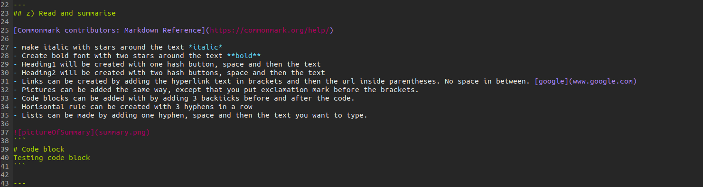

# Configuration Management - Homework #3

## Assignment
z) Read and summarise the article with a few French lines. This z subsection does not require any computer testing.

[Commonmark contributors: Markdown Reference](https://commonmark.org/help/) (note at least headings with hyphens, paragraph breaks on blank lines, indentation (tab) code, list, link, image.

a) MarkDown. Make a report of this assignment as a MarkDown. It is easiest to make the report in a GitHub repository, so that md-ended files are automatically formatted. A blank line makes the paragraph division, a dash '#' makes the title, an indent marks the code snippet.

b) Pull first. Make several changes to your git repository. Make a few changes where one commit applies to multiple files. Give a good description (commit message), one English sentence in imperative (imperative form) "Add top level menu to Foobar synchronizer"

b) All recorded. In your git repository, show examples of the commands 'git log', 'git diff' and 'git blame'. Explain the results.

c) Huppis! Make a stupid change to git, don't commit. Destroy bad changes with 'git reset --hard'. Note that there is no undo button for this action.

d) Formula. Make a new salt mode (formula, module, infra as code). (i.e. a new file e.g. /srv/salt/terontila/init.sls). You can do a simple couple of functions (pkg, file...), or more advanced, install and configure any new program: a daemon, a desktop program, or a program running from a command prompt. If necessary, use 'find -printf "%T+ %p\n"|sort' to find new configuration files.

f) Optional: put srv/salt/ in git. Make a new module. Clone your repository to another machine (or remove srv/salt and restore it by cloning) and continue with that.

e) Optional: Own dog food. Adjust one of the machines you are using with Salt.

---
## z) Read and summarise

[Commonmark contributors: Markdown Reference](https://commonmark.org/help/)

- make italic with stars around the text *italic*
- Create bold font with two stars around the text **bold**
- Heading1 will be created with one hash button, space and then the text
- Heading2 will be created with two hash buttons, space and then the text
- Links can be created by adding the hyperlink text in brackets and then the url inside parentheses. No space in between. [google](www.google.com)
- Pictures can be added the same way, except that you put exclamation mark before the brackets.
- Code blocks can be added with by adding 3 backticks before and after the code.
- Horisontal rule can be created with 3 hyphens in a row
- Lists can be made by adding one hyphen, space and then the text you want to type.


```
# Code block
Testing code block
```

---
## a) Markdown

