# Configuration Management - Homework #3

## Assignment
z) Read and summarise the article with a few French lines. This z subsection does not require any computer testing.

[Commonmark contributors: Markdown Reference](https://commonmark.org/help/) (note at least headings with hyphens, paragraph breaks on blank lines, indentation (tab) code, list, link, image.

a) MarkDown. Make a report of this assignment as a MarkDown. It is easiest to make the report in a GitHub repository, so that md-ended files are automatically formatted. A blank line makes the paragraph division, a dash '#' makes the title, an indent marks the code snippet.

b) Pull first. Make several changes to your git repository. Make a few changes where one commit applies to multiple files. Give a good description (commit message), one English sentence in imperative (imperative form) "Add top level menu to Foobar synchronizer"

b) All recorded. In your git repository, show examples of the commands 'git log', 'git diff' and 'git blame'. Explain the results.

c) Huppis! Make a stupid change to git, don't commit. Destroy bad changes with 'git reset --hard'. Note that there is no undo button for this action.

d) Formula. Make a new salt mode (formula, module, infra as code). (i.e. a new file e.g. /srv/salt/terontila/init.sls). You can do a simple couple of functions (pkg, file...), or more advanced, install and configure any new program: a daemon, a desktop program, or a program running from a command prompt. If necessary, use 'find -printf "%T+ %p\n"|sort' to find new configuration files.

f) Optional: put srv/salt/ in git. Make a new module. Clone your repository to another machine (or remove srv/salt and restore it by cloning) and continue with that.

e) Optional: Own dog food. Adjust one of the machines you are using with Salt.

---
## z) Read and summarise

[Commonmark contributors: Markdown Reference](https://commonmark.org/help/)

- make italic with stars around the text *italic*
- Create bold font with two stars around the text **bold**
- Heading1 will be created with one hash button, space and then the text
- Heading2 will be created with two hash buttons, space and then the text
- Links can be created by adding the hyperlink text in brackets and then the url inside parentheses. No space in between. [google](https://www.google.com)
- Pictures can be added the same way, except that you put exclamation mark before the brackets.
- line of code can be added by putting the code inside backticks
- Code blocks can be added with by adding 3 backticks before and after the code.
- Horisontal rule can be created with 3 hyphens in a row
- Lists can be made by adding one hyphen, space and then the text you want to type.

```
# Code block
Testing code block
```

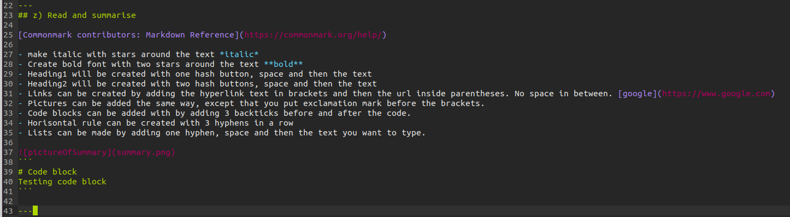
---
## a) Markdown

So the task was to create this report with markdown. I decided to upload this task to github.

I started task by creating a "configurationManagement" repository in github. I made it public and gave it a GNU 2.0 license.

Then I cloned the repository to my computer with a command:

`git clone git@github.com:JyriLampio/configurationManagement.git`

Then I browsed in to that newly created directory in my computer. I noticed that it had clone the license and readme file from github to my computer.
Then I created configurationmanagement3.md file on the directory and started doing homework.

## b) Pull First. Make several changes to your git repository. Make a few changes where one commit applies to multiple files.

Once I got the assignment's topic, task z and a done, I decided to make a commit to the git repository. I wrote the following in my terminal:

```
git add . #adds a change in the working directory to the staging area
git commit #captures a snapshot of the project's currently staged changes
git pull #pull's and download's content from a remote repository to and update the local repository to match the content. 
git push #Upload's local repository content to a remote repository
```
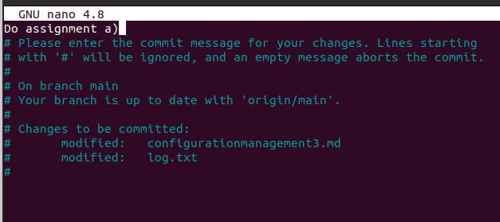
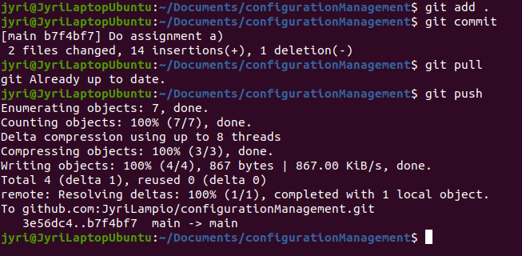

Then I chose to demonstrate a commit with multiple files in one commit. 

I created two example files called example.md and example2.md and wrote some text in them. I also edited the homework file so there should be 4 different files in one commit (log file also). I once again ran the commands stated earlier.

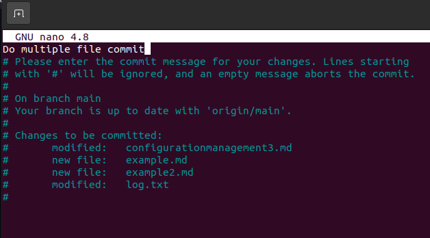 

Overall I did several different changes to the repository, but I only showed two here.

b) All recorded. In your git repository, show examples of the commands 'git log', 'git diff' and 'git blame'. Explain the results.

git log:

when you type git log, you can see all the commits done to that git repository. 
- The first info shows the unique hash of the specific commit.
- The second line is the author so the person who has made the changes.
- Third line is date and time when the commit was done.
- The fourth line is the comment wrote in the commit.

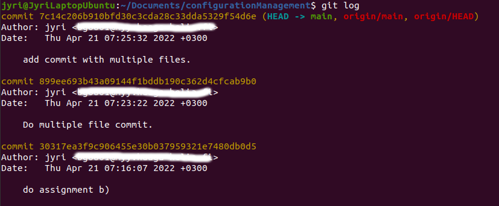

git diff:

git diff tells you the latest changes made to the file. The example used in the picture is configurationmanagement3.md. Red shows the previous text, green the modified text.

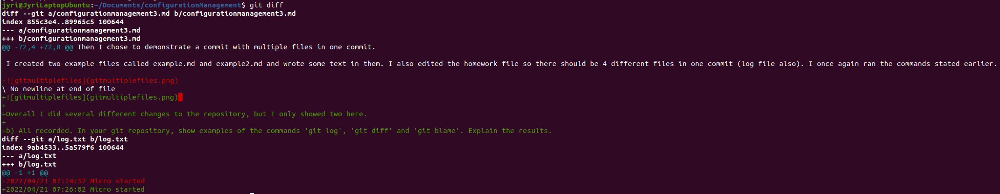

git blame:

The git blame command can be used to search for log information about a particular file. It shows:
- who has made the change and what time and date.
- what changes have been made to a particular file.

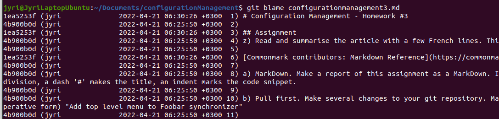

## c) Huppis! Make a stupid change to git, don't commit. Destroy bad changes with 'git reset --hard'. Note that there is no undo button for this action.

I created a badfile.txt on my directory. Then i ran git add . command. Once that was done i ran git status command. I saw that there were changes to be committed and the change was the badfile. Then i run the command "git reset --hard" and checked the status afterwards. Now it stated that the working tree was clean so the change was undone. Be careful as this command revers back to the latest commit.

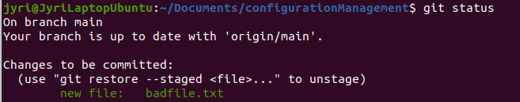
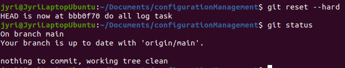


## d) Formula. Make a new salt mode (formula, module, infra as code).

I decided to create a new salt-state that install's vlc media player, gimp and libreoffice.

I created a new directory called apps in my salt folder on /etc/salt/

Then I created an init.sls file inside it and wrote the following code:

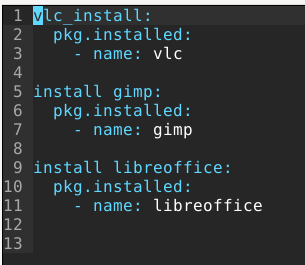

Then I ran it with:

`sudo salt '*' state.apply apps`

It worked! 

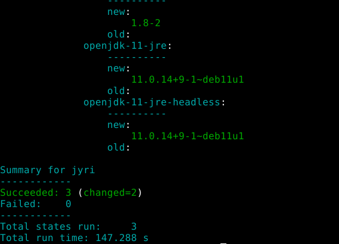